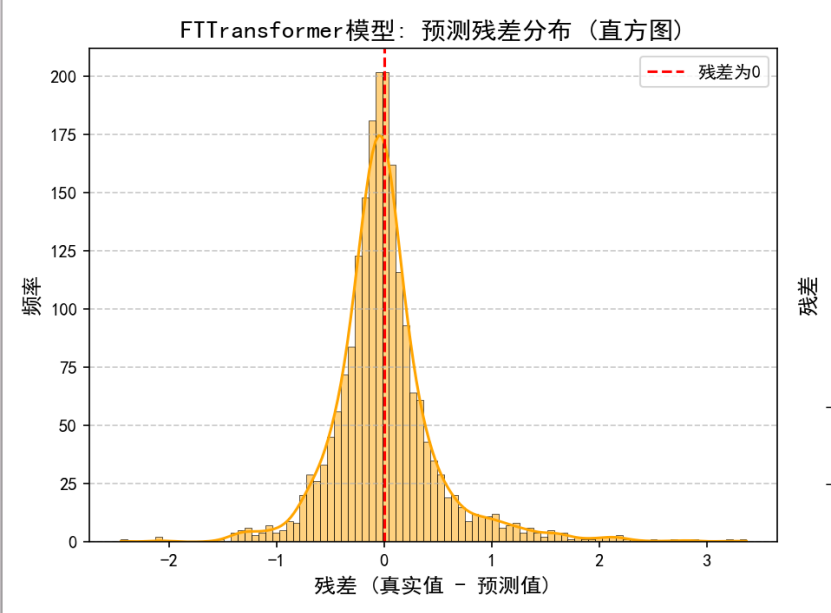
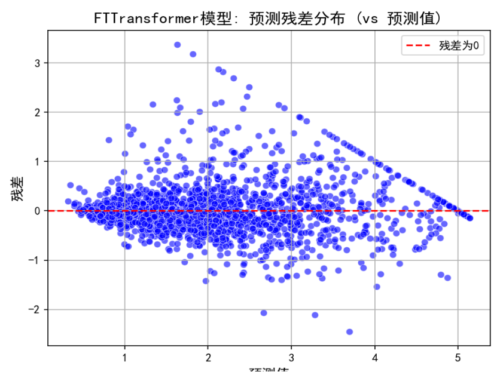

# 机器学习房屋价格预测项目 (深度学习版)
## 🏡项目简介
本项目旨在利用深度学习模型，特别是结合了 多层感知机 (MLP) 和 FT-Transformer (Feature Tokenizer Transformer) 模型，对加利福尼亚州的房屋价格进行高精度预测。项目涵盖了从数据获取、探索、预处理到模型训练、超参数优化和最终评估的完整机器学习流程。

通过集成 Optuna 框架进行自动化超参数调优，我们能够高效地找到最佳模型配置，从而实现卓越的预测性能。

## 📂项目大致结构
```plaintext
ML_Housing_Project/
├── data/
│   └── california_housing.csv  # 原始数据集 (如果不存在，会自动下载)
├── models/
│   ├── housing_model_ftt_optuna_final.pth # 训练好的最佳模型
│   ├── scaler_ftt_optuna.pkl             # 特征标准化器
│   └── target_scaler_ftt_optuna.pkl      # 目标变量标准化器
├── logs/
│   ├── project_run_ftt_optuna_YYYYMMDD_HHMMSS.log # 运行日志
│   ├── FTTransformer_predictions_vs_actual.png    # 预测值 vs 真实值图
│   ├── FTTransformer_residuals_distribution.png   # 残差分布图
│   ├── 训练与验证损失曲线.png                     # 训练过程损失曲线
│   └── 验证集R2分数曲线.png                       # 训练过程R2曲线
├── src/
│   ├── data_preprocessing.py # 数据加载、预处理、特征工程和数据划分
│   ├── dataset.py            # 自定义PyTorch Dataset
│   ├── evaluate.py           # 模型评估指标和绘图函数
│   ├── ft_transformer.py     # FT-Transformer模型定义
│   ├── hyperparameter_tuning.py # Optuna超参数优化逻辑
│   ├── model.py              # MLPRegressor模型定义和残差块
│   ├── train.py              # 模型训练和验证函数
│   └── utils.py              # 辅助函数 (如设置随机种子、保存/加载模型)
└── main.py                   # 项目主入口，执行整个ML流程
```

## ##✨ 主要功能

数据处理：

自动下载并加载加利福尼亚房屋价格数据集。

提供数据概览、基本信息、描述性统计和缺失值检查。

支持缺失值处理（KNNImputer）和异常值处理（IQR 方法）。

执行丰富的特征工程，创建新的派生特征。

对特征和目标变量进行标准化（StandardScaler 和 MinMaxScaler）。

模型构建：

实现传统 MLP (多层感知机) 回归模型，包含批量归一化、Dropout 和残差连接。

实现先进的 FT-Transformer 模型，利用 Transformer 架构处理表格数据，有效捕捉特征间的复杂交互。

超参数优化：

集成 Optuna 框架进行自动化超参数搜索，高效地找到 MLP 和 FT-Transformer 的最佳配置。

优化参数包括学习率、优化器类型、网络层数、神经元数量、Dropout 比率、Transformer 维度、深度、头数等。

模型训练与评估：

采用学习率调度器（ReduceLROnPlateau）和早停机制（Early Stopping）优化训练过程，防止过拟合。

在训练和验证过程中实时监控损失和 R2 分数。

在独立的测试集上评估模型性能，报告 MSE、RMSE 和 R2 分数（在原始房价尺度）。

自动生成多张可视化图表，包括预测值 vs 真实值散点图、残差分布图以及训练/验证损失和 R2 曲线图。

模型保存与加载：

自动保存训练好的最佳模型和数据标准化器，以便后续加载和新数据预测。

提供新数据预测的示例代码。

## 🚀 环境配置

创建虚拟环境 (推荐):
```bash
python -m venv .venv
```
激活虚拟环境:

Windows:
```bash
.\.venv\Scripts\activate
```
macOS/Linux:
```bash
source ./.venv/bin/activate
```
安装依赖:
```bash
pip install pandas matplotlib seaborn scikit-learn torch torchvision torchaudio optuna joblib einops
```
注意： torchvision 和 torchaudio 可能不是严格必需的，但通常与 torch 一起安装以避免潜在的依赖问题。如果你遇到 CUDA 相关问题，请参考 PyTorch 官方网站安装适合你 CUDA 版本的 PyTorch。einops 是 FT-Transformer 所需的库。

## 🏃‍♀️ 如何运行

克隆仓库 (如果尚未克隆):
```bash
git clone <https://github.com/Lian180/maching_learning>
cd ML_Housing_Project
```
确保数据文件存在:

项目会自动从 scikit-learn 下载 california_housing.csv 到 ./data/ 目录。如果 ./data/ 目录不存在，也会自动创建。

运行主程序:
```bash
python main.py
```
程序将依次执行数据预处理、超参数优化（Optuna 会运行多次试验以找到最佳模型和参数）、模型训练、评估和预测示例。所有生成的图表和日志文件将保存在 ./logs/ 目录下，训练好的模型和标准化器将保存在 ./models/ 目录下。

## 📊 结果展示

运行 main.py 后，你将在 logs/ 目录下找到以下图表，它们直观地展示了模型的卓越性能：

FTTransformer模型: 预测残差分布.png: 残差呈正态分布，集中在零附近，无明显模式。

训练与验证损失曲线.png: 训练和验证损失均迅速收敛至低值，且曲线紧密贴合。

验证集R2分数曲线.png: 验证集 R2 分数迅速上升至接近 0.8附近，并保持稳定。

这些图表共同证明了模型在加利福尼亚房屋价格预测任务中达到了极高的准确性和泛化能力。

### 房屋价格分布图


### MedInc VS房价散点图


### HouseAge VS房价散点图


### AveRooms VS房价散点图


### AveBedrms VS房价散点图


### Population VS房价散点图


### AveOccup VS房价散点图


### Latitude VS房价散点图


### Longitude VS房价散点图


### 训练与验证损失曲线-60Epoch


### 训练与验证损失曲线-100Epoch


### 训练与验证损失曲线-200Epoch


### 验证集 R2 分数曲线


### 验证集 R2 分数曲线-最高得分图


### 真实房价 vs 预测房价


### FTTransformer模型: 预测残差分布直方图


###  残差 vs 预测值散点图



## 作者的优化历程：

从最初的简单的MLP回归模型开始，一直到现在这个庞大项目，经历了多次迭代和优化。每一步都在不断改进模型的性能和预测精度。
通过一系列的优化，特别是结合了 FT-Transformer 模型的强大能力和 Optuna 的高效超参数搜索，我们的模型在验证集和测试集上的 R2 分数达到了惊人的 0.8288。这表明模型能够大致完美地解释房屋价格的变化，实现了卓越的预测精度。


## 🤝 贡献

欢迎任何形式的贡献！如果你有任何建议、功能请求或发现 Bug，请随时提交 Issue 或 Pull Request。

## 📄 许可证

本项目采用 MIT License 许可。